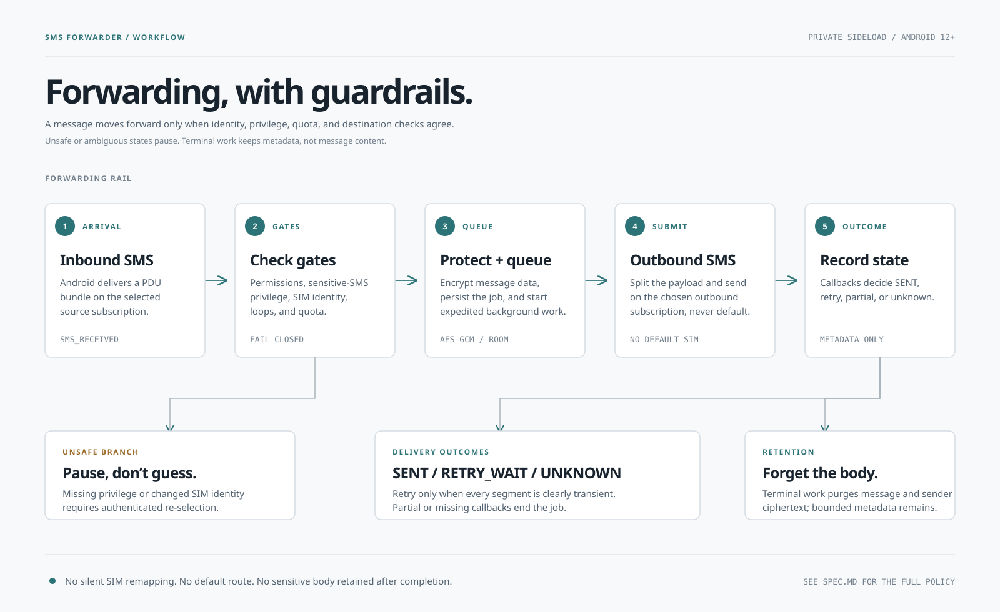

# SMS Forwarder

SMS Forwarder is an Android app for private use.
The app receives a text message (SMS) on one SIM and forwards it to a verified destination number.
The app can use a different SIM to send the forwarded message.

> **Caution — privacy risk:** Use only phones that you control for this app and the destination phone.
> A person with access to the destination phone can read every forwarded message.

This project is experimental.

The app is not a Google Play app.
It is not a cloud service or a replacement for a messaging app.

- **Android version:** Android 12 or later
- **Package name:** `com.johnc4rl0.smsforwarder`
- **Installation method:** ADB or a managed installer

This README uses the term **SIM** for a physical SIM or an embedded SIM (eSIM).

## What the app does

- The app receives text SMS from the selected inbound SIM.
- The app sends each message through the selected outbound SIM.
- The app sends messages only to the verified destination number.
- The app adds the original sender and the source line to the forwarded message.
- The app stops forwarding when a safety check fails.
- The app does not need internet access, an account, analytics, or a server.

```text
Inbound SIM → safety checks → outbound SIM → verified destination number
```

The forwarded message has this format:

```text
[SMS-FWD/1] From <sender> via <source line>
<original message>
```

### Workflow

[](docs/workflow.svg)

Open the [UI storyboard](docs/material3-mockups/workflow-storyboard.html) for the app screens.

## What the app does not do

- The app does not select the default SIM if the selected SIM is unavailable.
- The app does not become the default SMS app.
- The app does not read old messages from the SMS inbox.
- The app does not support MMS, RCS, WAP Push, contacts, or notifications from banking apps.
- The app does not send data to a cloud service.
- The app does not hide or change the identity of the outbound SIM.
- The destination phone shows the outbound SIM as the sender.

A carrier can return an uncertain send result.
The app cannot guarantee that it sends such a message exactly one time.

## Requirements

You must have:

- An Android 12 or later phone that can send and receive SMS through a mobile carrier.
- Two SIMs if you want a different inbound SIM and outbound SIM.
- Android Debug Bridge (ADB) or an equivalent managed installer.
- USB debugging or wireless debugging, with authorization for your computer.
- Java Development Kit (JDK) 17 and the Android SDK.
- A secure phone screen lock.

Android classifies the SMS permissions as **hard-restricted permissions**.
A file manager cannot install and configure the app correctly.

Use the supplied install script.
The script verifies the APK before it grants the SMS permissions.

### One-time passwords and security messages

One-time password (OTP) delivery depends on the phone and the Android version.
On Android 15 and later, the app requires the sensitive-SMS privilege.
Android 17 can delay a standard OTP SMS.
Android can require an eligible exemption to prevent this delay.

> **Caution — delivery risk:** If you did not test OTP delivery on the applicable phone, do not use time-critical OTP forwarding.
> A delayed OTP can prevent timely account access.

Before you use OTP forwarding, read the [compatibility matrix](docs/compatibility.md).

Carrier charges, roaming rules, filtering, outages, and SMS limits can affect delivery.

## Build and install the app

Create a release key.
Follow the [release-signing guide](docs/release-signing.md).
Keep the key outside this repository.
Do not commit the key or its passwords.

Build the release APK:

```bash
./gradlew assembleRelease
```

Show the release certificate fingerprint from your protected keystore:

```bash
keytool -list -v \
  -keystore "$HOME/.config/sms-forwarder/sms-forwarder-release.jks" \
  -alias sms-forwarder-release
```

Copy the SHA-256 certificate fingerprint from the output.
Set this trusted fingerprint for the install command:

```bash
export SMS_FORWARDER_RELEASE_CERT_SHA256="PASTE_THE_VERIFIED_SHA256_FINGERPRINT_HERE"
```

Connect the authorized phone.
Use this command to identify the phone:

```bash
adb devices -l
```

If you connect more than one phone, set `ANDROID_SERIAL`:

```bash
export ANDROID_SERIAL="PASTE_THE_AUTHORIZED_DEVICE_SERIAL_HERE"
```

Install the release APK:

```bash
./scripts/install-private.sh
```

The script verifies the package name and the manifest permissions.
It also verifies the debug status, the APK signature, and the release certificate against your trusted fingerprint.
The script then grants the required SMS permissions and appops.

Use a debug APK only for development:

```bash
./gradlew assembleDebug
./scripts/install-private.sh --allow-debug
```

> **Caution — privacy risk:** Do not use a debug APK on a phone that receives confidential messages.
> USB debugging tools can access the data in a debug APK.

If macOS cannot find Java, set `JAVA_HOME` to the Android Studio JDK:

```bash
export JAVA_HOME="/Applications/Android Studio.app/Contents/jbr/Contents/Home"
```

## Set up the app

1. Open the app.
2. Read the forwarding disclosure.
3. Accept the disclosure if you agree.
4. Complete the permission checks.
5. Complete the notification checks.
6. Turn off the unused-app restrictions for this app.
7. Select the inbound SIM.
8. Select the outbound SIM.
9. Enter the destination number.
10. Verify the destination number with the code.
11. Authenticate with the phone screen lock.
12. Turn on forwarding.

The app stops forwarding if it cannot validate a selected SIM.
The app also stops forwarding if a required permission or privilege becomes unavailable.
Open the app.
Correct the applicable setting.

## Privacy and safety

- The app does not request access to the internet, contacts, location, or storage.
- The app encrypts stored message data with keys from Android Keystore.
- The app deletes message text and sender data after a final result.
- The app also deletes this data after a pause, a setup change, or the storage time limit.
- The app keeps only result metadata for recent forwarding attempts.
- The app disables app backup and device-to-device data transfer.
- The app does not write messages, OTPs, senders, or full phone numbers to logs.
- The app limits the number of messages that it can forward in 24 hours.
- The app detects forwarding loops and stops unsafe forwarding.
- The app lets you pause forwarding from the app or its notification.

Read [SPEC.md](SPEC.md) for the complete security and retention rules.

Report a security problem through [SECURITY.md](SECURITY.md).
Do not include real messages, OTPs, phone numbers, or device identifiers in the report.

## Common problems

| Problem | Action |
|---|---|
| Java is not available. | Install JDK 17. Alternatively, use the Android Studio JDK. |
| Android does not grant an SMS permission. | Install the APK again with `scripts/install-private.sh`. Do not use a file manager. |
| Forwarding stops after a force-stop. | Open the app. Use the Pause control instead of a force-stop. |
| Forwarding stops after a selected SIM change. | Open the app. Select the applicable SIM again. |
| An OTP is late or does not arrive. | Read the compatibility matrix. Test the app on the applicable phone. |

## Development checks

These checks do not need a connected phone:

```bash
./gradlew lint test assembleDebug
./scripts/install-private-test.sh
./scripts/release-signing-test.sh
```

Connected tests and installation change the selected phone.
Before you run them, read [docs/testing.md](docs/testing.md).
Use `adb devices -l` to identify the phone.
Before you continue, set `ANDROID_SERIAL`.

## Documentation

- [Product and security specification](SPEC.md)
- [Android compatibility](docs/compatibility.md)
- [Release signing](docs/release-signing.md)
- [Test instructions](docs/testing.md)
- [Security reports](SECURITY.md)
- [UI mockups](docs/material3-mockups/README.md)

## License

This project uses the Apache License, Version 2.0.
Read [LICENSE](LICENSE) for the license terms.
